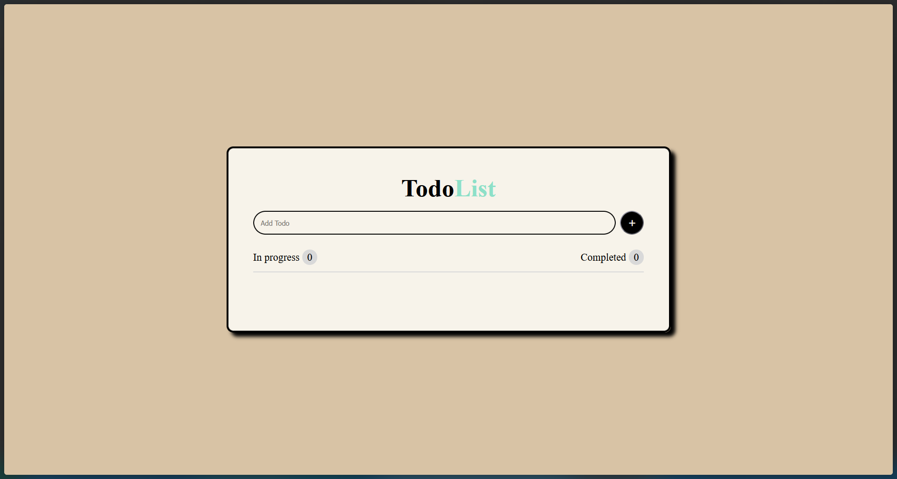

# Todo List App

A simple, interactive Todo List application built with HTML, CSS, and JavaScript. This app allows users to add tasks, mark them as completed, and delete them, with real-time counters for in-progress and completed tasks.

## Features

- **Add Tasks**: Enter a task in the input field and click the plus button or press Enter to add it to the list.
- **Mark as Completed**: Check the checkbox next to a task to mark it as completed, which applies a strikethrough effect.
- **Delete Tasks**: Click the trash icon to remove a task from the list.
- **Task Counters**: Displays the number of tasks in progress and completed.
- **Responsive Design**: Adapts to different screen sizes, including mobile devices.

## Technologies Used

- **HTML**: Structure of the application.
- **CSS**: Styling and layout, including responsive design.
- **JavaScript**: Functionality for adding, completing, and deleting tasks.
- **FontAwesome**: Icons for the add button and other UI elements.

## How to Use

1. Clone or download the project files.
2. Open `index.html` in your web browser.
3. Start adding tasks using the input field and button.

No additional setup or dependencies are required, as it's a static web application.

## File Structure

- `index.html`: Main HTML file containing the structure.
- `main.css`: Stylesheet for the application's appearance.
- `app.js`: JavaScript file handling the app's logic.
- `trash.png`: Icon used for the delete button.
- `screenshot.png`: Screenshot of the application.
- `README.md`: This file.

## Screenshots

